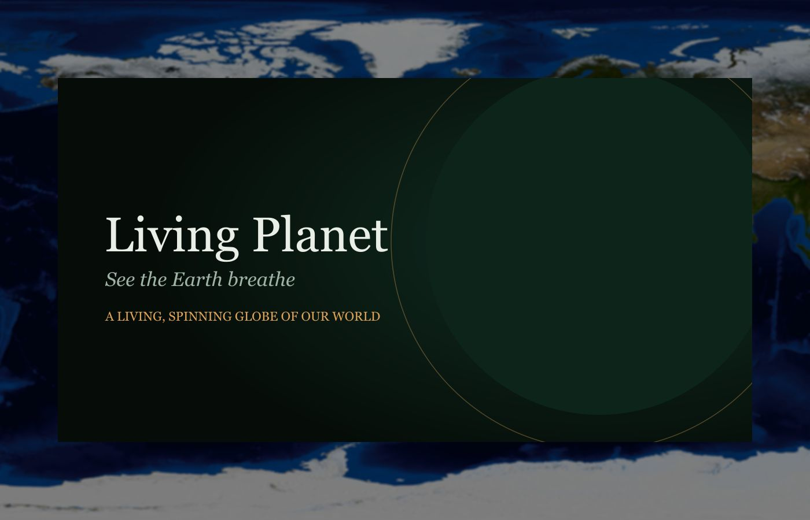

# Living Planet

**See the Earth breathe** — a living, spinning 3D globe you can orbit, fly, and listen to.

Living Planet is a cinematic Earth explorer built with React, TypeScript, three.js, and Tailwind CSS. Nine of the planet's most extraordinary places are rendered with real NASA satellite imagery on an interactive WebGL globe, each with its own story, statistics, and synthesized soundscape.



## Features

- **Interactive 3D globe** — drag to orbit, scroll to zoom. NASA Blue Marble imagery with terrain relief, a drifting cloud layer, and a glowing atmosphere.
- **Fly-to navigation** — click any destination and the planet rotates itself to bring that exact spot to center, marked by a pulsing amber pin.
- **Real-time day/night terminator** — the sun sits at its true subsolar point, computed from live UTC time. Where you see night, it *is* night.
- **Night-lights mode** — crossfade to NASA's city-lights imagery and watch human civilization glow.
- **Living soundscapes** — every place has its own voice, synthesized live with the Web Audio API: rain shimmer in the Amazon, dry gusts in the Sahara, a deep glacier rumble in Iceland, wave wash in the Galápagos.
- **Journeys** — four curated collections that thread places into stories: *Shaped by water*, *Fire and ice*, *The green lung*, *Earth, at its extremes*.
- **Atlas** — a searchable index of all nine places, each card a real satellite crop of its coordinates.
- **Favorites** — save places to "My journeys" (stored locally in your browser).
- **Cinematic intro** — on first visit, the camera dollies down from deep space as the headline fades in.

## The places

Amazon Rainforest · Andes Mountains · Galápagos Islands · Amazon River Delta · Sahara Desert · The Himalayas · Great Barrier Reef · Iceland Highlands · Patagonian Ice Fields

## Getting started

```bash
npm install
npm run dev      # http://localhost:5173
```

Other scripts:

```bash
npm run build    # production build to dist/
npm run preview  # serve the production build locally
node scripts/optimize-textures.mjs   # regenerate public/textures-opt from public/textures
```

## Tech

- **React 19 + TypeScript + Vite** (Tailwind CSS v4)
- **three.js** via `@react-three/fiber` + `@react-three/drei`
- **Framer Motion** for entrance choreography
- **react-router** for Atlas, Journeys, and destination views
- **Web Audio API** for fully synthesized ambient sound (no audio files)
- **sharp** for texture optimization (8.9 MB of raw NASA imagery → ~1.4 MB WebP)
- three.js is code-split into an async chunk (151 KB gzip) with a skeleton loader

## Deployments

- **GitHub Pages** — a GitHub Actions workflow (`.github/workflows/deploy-pages.yml`) builds and deploys on every push to `main`.
- **Verdent hosting** — the `.verdentc.json` manifest makes the project one-click publishable from the Verdent desktop app.

## Credits

- Earth imagery: [NASA Blue Marble / Black Marble](https://earthobservatory.nasa.gov/features/BlueMarble)
- Built with [Verdent](https://www.verdent.ai)

## License

Imagery courtesy of NASA (public domain). Code: MIT.
